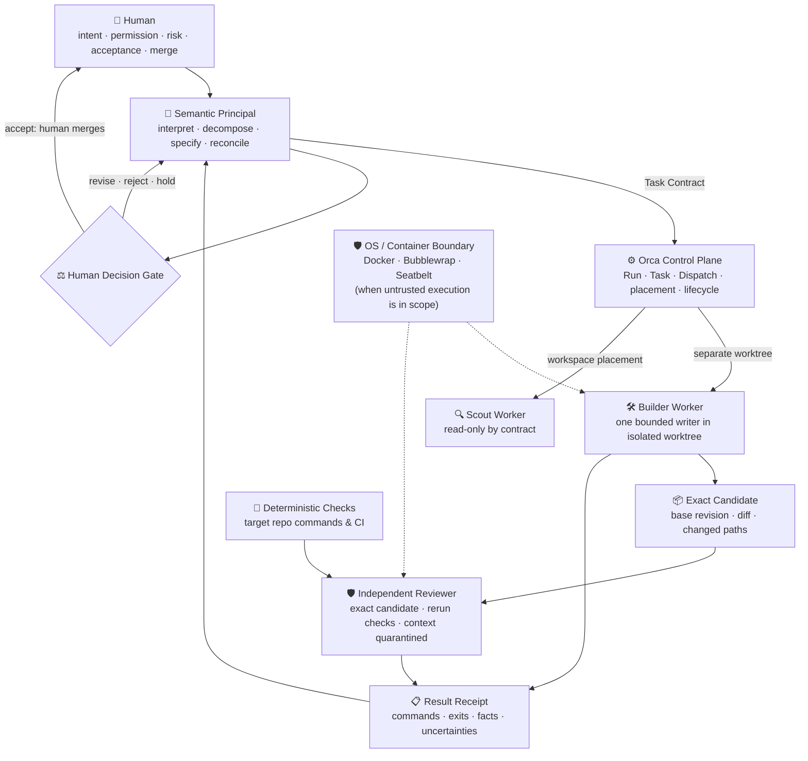

<h1 align="center">Omega Zero</h1>

<p align="center">
  <b>Deterministic Multi-Agent Governance Protocol & Evidence Verification.</b><br>
  The operating profile for AI-assisted engineering on Orca — bounded authority, task contracts, independent review with context quarantine, and deterministic proof receipts before human merge.
</p>

<p align="center">
  <a href="#-two-things-in-one-repo">Overview</a> &middot;
  <a href="#-why-omega-zero">Why Omega Zero</a> &middot;
  <a href="#-independent-candidate-review">Reviewer Rigor</a> &middot;
  <a href="#-case-study-when-green-tests-lie">Case Study</a> &middot;
  <a href="#-quickstart--verification">Quickstart</a> &middot;
  <a href="docs/ARCHITECTURE.md">Architecture</a>
</p>

<p align="center">
  <a href="https://github.com/TomaszGonczar/omega-zero/actions/workflows/ci.yml"></a>
  <a href="https://github.com/TomaszGonczar/omega-zero/releases"></a>
  <a href="https://opensource.org/licenses/MIT"></a>
  <a href="https://www.python.org/"></a>
  <a href="#"></a>
  <a href="SECURITY.md"></a>
</p>

---

## 📦 Two things in one repo

📋 **An operating governance profile** — an authoritative contract that separates concerns: one semantic Principal, bounded worker tasks in isolated Git worktrees, independent review of the exact candidate, and human-only merge authority.

🧪 **A deterministic reference validator** — a pure Python standard-library verification engine ([`tools/validate_evidence.py`](tools/validate_evidence.py)) that enforces proof-of-claim receipts, zero-collected negative fixtures, 2 MiB DoS bounds, and canonical path containment in sub-10ms with zero pip bootstrapping.

Both are designed for **Orca**, work with **any model** (Claude, GPT, Gemini, local), and guarantee that probabilistic LLMs cannot sneak unverified code past your human merge gate.

---

## 🛡️ Independent Candidate Review

Most agent architectures suffer from a critical failure mode: **the agent that writes the code evaluates its own work** (or reviews its own conversational chain-of-thought). When an agent self-evaluates, it confirms its own hallucinations, repeats prompt biases, and easily passes self-generated, vacuous tests.

Omega Zero breaks this loop with **air-gapped candidate review**:

```
                              ┌──  Builder in Worktree A  ── writes code strictly in allowed_paths
   Task Contract (frozen SHA) ─┼──  Candidate Git Diff     ── base_sha..candidate_sha
                               └──  Context Quarantine      ── Builder scratchpads & reasoning BLOCKED
                                             │
                                             ▼
                             🛡️  Independent Reviewer in Worktree B
                                 (evaluates candidate as untrusted data,
                                  reruns checks, reports severity-ranked findings)
                                             │
                                             ▼
                                 ⚖️  Human Decision Gate
                                     (human reviews evidence receipt & merges)
```

1. **Context Quarantine**: The Reviewer receives *only* the raw unified diff (`git diff`) and the immutable base commit SHA. Builder scratchpads, prompt traces, and conversational tokens are strictly quarantined to eliminate confirmation bias.
2. **Passive Data Treatment**: Candidate source files and commit messages are evaluated strictly as passive data, disarming embedded prompt injections.
3. **Deterministic Grounding**: The Reviewer independently executes target repository commands on a clean checkout, capturing raw exit codes and stdout.

---

## 🔍 Case Study: When Green Tests Lie

In this repository's initial end-to-end run, the Builder worker implemented the reference validator. The candidate's unit test suite passed with **100% green status**.

However, the **Independent Reviewer** analyzed the exact revision and caught a critical schema-version bypass: in Python, `bool` subclasses `int` and `True == 1`. The candidate accepted boolean `true` and float `1.0` where integer `schema_version: 1` was strictly required by the contract.

Because Omega Zero mandates **independent candidate review** and **evidence-before-completion**:
- The defect was reproduced and reported as a P2 finding.
- The candidate was rejected.
- A strict integer guard (`isinstance(v, int) and not isinstance(v, bool)`) and regression tests were added.
- The corrected candidate was re-reviewed and accepted by the human principal.

Read the full incident breakdown in [`docs/CASE_STUDY.md`](docs/CASE_STUDY.md).

---

## 🚀 Two ways to use it

### 1. In Your Local Repo / Agent Workflow
Use the operating contract in [`AGENTS.md`](AGENTS.md) and contract templates in [`docs/WORKFLOW.md`](docs/WORKFLOW.md) to govern your coding agents:
1. Formulate a **Task Contract** from your current base commit with strict `allowed_paths`.
2. Dispatch a Builder into a clean Git worktree.
3. Dispatch an Independent Reviewer to test the exact diff in a separate worktree.
4. Collect the **Result Receipt** and validate it before merging.

### 2. In Continuous Integration (CI Gate)
Integrate the reference validator directly into your CI pipeline as a zero-dependency pre-merge gate:

```bash
python3 tools/validate_evidence.py \
  --contract examples/task-contract.json \
  --receipt examples/result-receipt.json
```
Output:
```json
{"error_count": 0, "errors": [], "valid": true}
```

Negative fixtures intentionally exit 1 with explicit error codes:
```bash
python3 tools/validate_evidence.py \
  --contract tests/fixtures/zero-collected/task-contract.json \
  --receipt tests/fixtures/zero-collected/result-receipt.json
```
Output:
```json
{"error_count": 1, "errors": ["ZERO_COLLECTED"], "valid": false}
```

---

## 🏛️ Runtime Architecture



### Authority Matrix

| Concern | Authority | Explicit Non-Authority |
|---|---|---|
| Goal, permission, risk acceptance, candidate acceptance, merge | **Human** | Principal, Orca, worker, Reviewer, checks |
| Semantic decomposition and synthesis | **Principal** | Worker majority, Orca lifecycle |
| Run/Task/Dispatch identity, delivery, placement, settlement | **Orca** | Markdown ledger, terminal title |
| One bounded attempt | **Worker CLI process** | This profile repository |
| Base, branch, commit, diff, ancestry | **Git** | Agent prose, copied identifiers |
| Check result | **Target repository commands & CI** | A `passed` field written by an author |
| Challenge to a candidate | **Independent Reviewer** | The candidate's author alone |
| Containment of untrusted execution | **OS kernel or container** | Git worktree, prompt text, regex gate |

---

## 🛡️ Layered Threat & Containment Model

Omega Zero explicitly separates contractual coordination from system security:

1. **Layer 1: Contractual Governance (Task Contracts & Receipts)**  
   Lexical boundaries enforcing `allowed_paths`, input file limits (2 MiB DoS guard), canonical POSIX paths, and required check evidence.
2. **Layer 2: Workspace State Isolation (Git Worktrees)**  
   Isolates concurrent mutations between cooperative agents on disk. A worktree is a workspace boundary, **not an execution sandbox**.
3. **Layer 3: Runtime Kernel Containment (OS / Container Sandbox)**  
   When dispatches execute untrusted third-party code or arbitrary shell commands, Layer 3 containment (Docker, Bubblewrap, macOS Seatbelt, or eBPF) must be enforced by the runtime.

---

## ⚡ Quickstart & Verification

Run the full local verification suite in sub-second time:

```bash
# 1. Run unit test suite (19 tests)
python3 -m unittest discover -s tests -p 'test_*.py' -v

# 2. Validate committed example contracts
python3 tools/validate_evidence.py --contract examples/task-contract.json --receipt examples/result-receipt.json

# 3. Validate first-real-run evidence
python3 tools/validate_evidence.py --contract evidence/first-real-run/task-contract.json --receipt evidence/first-real-run/result-receipt.json

# 4. Verify negative fixture (must exit 1 with ZERO_COLLECTED)
python3 tools/validate_evidence.py --contract tests/fixtures/zero-collected/task-contract.json --receipt tests/fixtures/zero-collected/result-receipt.json
```

---

## 📋 Repository Map

| Path | Purpose |
|---|---|
| [`AGENTS.md`](AGENTS.md) | The operating contract an agent reads before acting in this repository |
| [`docs/ARCHITECTURE.md`](docs/ARCHITECTURE.md) | Runtime sequence, authority matrix, monitoring, and threat boundaries |
| [`docs/WORKFLOW.md`](docs/WORKFLOW.md) | Task Contract and Result Receipt templates, run sequence, evidence rules |
| [`docs/CASE_STUDY.md`](docs/CASE_STUDY.md) | Narrative chronicle of the first real run, defect discovery, and correction |
| [`tools/validate_evidence.py`](tools/validate_evidence.py) | Standard-library reference validator for contract/receipt JSON |
| [`examples/`](examples/) | A valid contract and receipt pair |
| [`tests/`](tests/) | Standard-library test suite (19 tests) plus zero-collected negative fixture |
| [`evidence/first-real-run/`](evidence/first-real-run/) | Sanitized public derivatives of the first real run's local evidence |
| [`.github/workflows/ci.yml`](.github/workflows/ci.yml) | Version-tagged GitHub Actions matrix checks (Python 3.11, 3.12, 3.13) |
| [`CONTRIBUTING.md`](CONTRIBUTING.md) | Development guidelines and invariant rules |
| [`SECURITY.md`](SECURITY.md) | Security threat boundaries and vulnerability disclosure |

---

## ⚖️ License

This project is licensed under the [MIT License](LICENSE).
