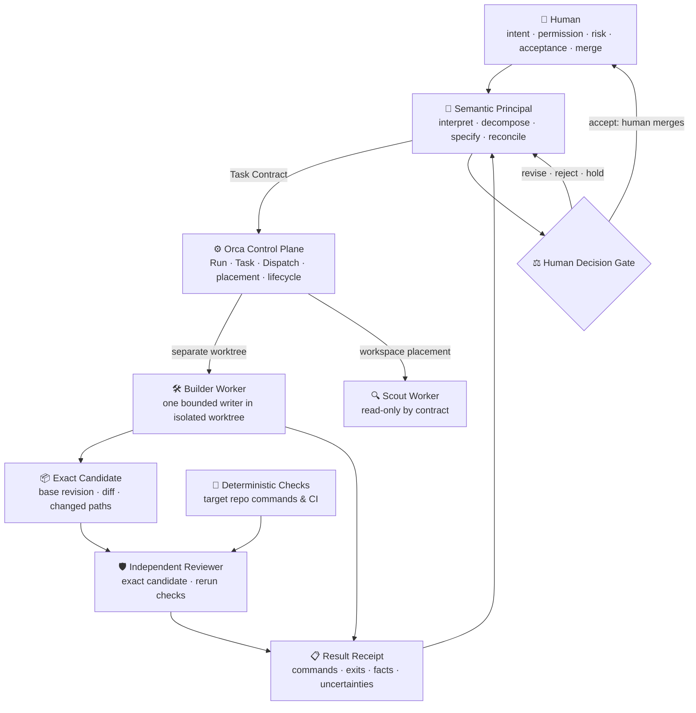

# Omega Zero

> **An operating profile & deterministic evidence protocol for multi-agent software engineering on Orca.**  
> Enforces bounded authority, strict task contracts, independent candidate review, and deterministic evidence receipts before any human merge gate.

[](https://github.com/TomaszGonczar/omega-zero/actions/workflows/ci.yml)
[](https://github.com/TomaszGonczar/omega-zero/releases)
[](https://opensource.org/licenses/MIT)
[](https://www.python.org/)
[](#)

---

## Why Omega Zero?

LLM coding agents are probabilistic; production software engineering requires deterministic consistency. When agents operate without strict governance:
- Agents issue completion claims that are speculative or unverified.
- Passing unit test suites frequently mask specification bypasses or schema drift.
- Unbounded writes spill into unauthorized files.

**Omega Zero** establishes a clean, human-governed operating profile around agent machinery:
1. **Single Human Authority**: The only entity authorized to set intent, accept risk, and perform merges.
2. **Semantic Principal**: Translates human intent into an immutable **Task Contract** (frozen base revision, allowed path boundaries, observable acceptance checks).
3. **Orca Control Plane**: Manages isolated Git worktrees, terminal processes, and durable lifecycle state.
4. **Single Bounded Writer**: One Builder agent per dispatch, isolated in its own worktree and restricted to declared paths.
5. **Independent Candidate Review**: An isolated Reviewer agent inspects and validates the exact candidate commit—never relying on agent self-reports or summaries.
6. **Deterministic Evidence Receipts**: Structured JSON receipts carrying command executions, exit codes, and declared facts, validated by a standard-library reference validator.

---

## Runtime Architecture



*For detailed sequence specifications, state lifecycles, and threat boundaries, see [`docs/ARCHITECTURE.md`](docs/ARCHITECTURE.md).*

---

## Authority Matrix

| Concern | Authority | Explicit Non-Authority |
|---|---|---|
| Goal, permission, risk acceptance, candidate acceptance, merge | **Human** | Principal, Orca, worker, Reviewer, checks |
| Semantic decomposition and synthesis | **Principal** | Worker majority, Orca lifecycle |
| Run/Task/Dispatch identity, delivery, placement, settlement | **Orca** | Markdown ledger, terminal title |
| One bounded attempt | **Worker CLI process** | This profile repository |
| Base, branch, commit, diff, ancestry | **Git** | Agent prose, copied identifiers |

---

## Case Study: Green Tests vs. Ground Truth

In this repository's initial end-to-end run, the Builder worker implemented the reference validator. The candidate's unit test suite passed with 100% green status.

However, independent review analyzed the exact revision and discovered a critical schema-version bypass: in Python, `bool` is a subclass of `int` and `True == 1`. The candidate accepted boolean `true` and float `1.0` where integer `schema_version: 1` was strictly required by the contract.

Because Omega Zero mandates **independent candidate review** and **evidence-before-completion**:
- The defect was reproduced and reported.
- The candidate was rejected.
- A strict integer guard and regression tests were added.
- The corrected candidate was re-reviewed and accepted by the human principal.

Read the complete incident breakdown in [`docs/CASE_STUDY.md`](docs/CASE_STUDY.md).

---

## Repository Contents

| Path | Purpose |
|---|---|
| [`AGENTS.md`](AGENTS.md) | The operating contract an agent reads before acting in this repository |
| [`docs/ARCHITECTURE.md`](docs/ARCHITECTURE.md) | Runtime sequence, authority matrix, monitoring, and threat boundaries |
| [`docs/WORKFLOW.md`](docs/WORKFLOW.md) | Task Contract and Result Receipt templates, run sequence, evidence rules |
| [`docs/CASE_STUDY.md`](docs/CASE_STUDY.md) | Narrative chronicle of the first real run, defect discovery, and correction |
| [`tools/validate_evidence.py`](tools/validate_evidence.py) | Standard-library reference validator for contract/receipt JSON |
| [`examples/`](examples/) | A valid contract and receipt pair |
| [`tests/`](tests/) | Standard-library test suite (17 tests) plus zero-collected negative fixture |
| [`evidence/first-real-run/`](evidence/first-real-run/) | Sanitized public derivatives of the first real run's local evidence |
| [`.github/workflows/ci.yml`](.github/workflows/ci.yml) | Version-tagged GitHub Actions matrix checks (Python 3.11, 3.12, 3.13) |

---

## Deterministic Reference Validator

The profile provides an optional reference validator at [`tools/validate_evidence.py`](tools/validate_evidence.py). It uses **only Python's standard library** (zero third-party dependencies) to validate Task Contracts and Result Receipts against the profile schema:

```bash
# Validate the committed examples
python3 tools/validate_evidence.py \
  --contract examples/task-contract.json \
  --receipt examples/result-receipt.json
```
Output:
```json
{"error_count": 0, "errors": [], "valid": true}
```

Negative fixtures intentionally exit 1 with explicit error codes:
```bash
# Validate negative fixture (zero tests collected)
python3 tools/validate_evidence.py \
  --contract tests/fixtures/zero-collected/task-contract.json \
  --receipt tests/fixtures/zero-collected/result-receipt.json
```
Output:
```json
{"error_count": 1, "errors": ["ZERO_COLLECTED"], "valid": false}
```

---

## Quickstart & Local Verification

Run the full repository verification suite locally:

```bash
# 1. Run the unit test suite
python3 -m unittest discover -s tests -p 'test_*.py' -v

# 2. Validate committed example contracts
python3 tools/validate_evidence.py --contract examples/task-contract.json --receipt examples/result-receipt.json

# 3. Validate the first-real-run evidence pair
python3 tools/validate_evidence.py --contract evidence/first-real-run/task-contract.json --receipt evidence/first-real-run/result-receipt.json

# 4. Verify the negative failure fixture (must exit 1 with ZERO_COLLECTED)
python3 tools/validate_evidence.py --contract tests/fixtures/zero-collected/task-contract.json --receipt tests/fixtures/zero-collected/result-receipt.json
```

---

## Hosted Continuous Integration

The GitHub Actions workflow ([`.github/workflows/ci.yml`](.github/workflows/ci.yml)) runs on `ubuntu-latest` across a matrix of Python **3.11**, **3.12**, and **3.13**.

On every push and pull request, it deterministically checks:
1. **Test Discovery Guard**: Fails with `ZERO_COLLECTED` if discovery finds 0 tests.
2. **Standard-Library Suite**: Executes all unittest cases.
3. **Committed Evidence Validation**: Verifies both the example pair and the first-run evidence pair report `valid: true`.
4. **Negative Fixture Guard**: Confirms that invalid fixtures exit code 1 and return expected error codes.

---

## Honest Status & Empirical Boundaries

To uphold the core principle of empirical truthfulness:

- **Exercised End-to-End**: Run `B1` produced the reference validator against this repository. Its full audit record is in [`evidence/first-real-run/`](evidence/first-real-run/).
- **Independent Review Verified**: The schema bypass (`True == 1`) was caught by independent review, fixed, regression-tested, and locally integrated.
- **Published & CI Verified**: The repository is published at [`TomaszGonczar/omega-zero`](https://github.com/TomaszGonczar/omega-zero) under the MIT license. Continuous integration has been verified on GitHub Actions across Python 3.11, 3.12, and 3.13 (Runs `#34937827742` and `#34937934764`).
- **No Auto-Merge**: Integration and merge authority remain exclusively human.
- **No Containment Claim**: Git worktrees separate file system workspace state for cooperative agents; they do not provide sandboxed security isolation.
- **No Scaling Claim**: One Builder and one Reviewer is the evaluated baseline; parallel mutations remain out of scope.

---

## License

This project is licensed under the [MIT License](LICENSE).
