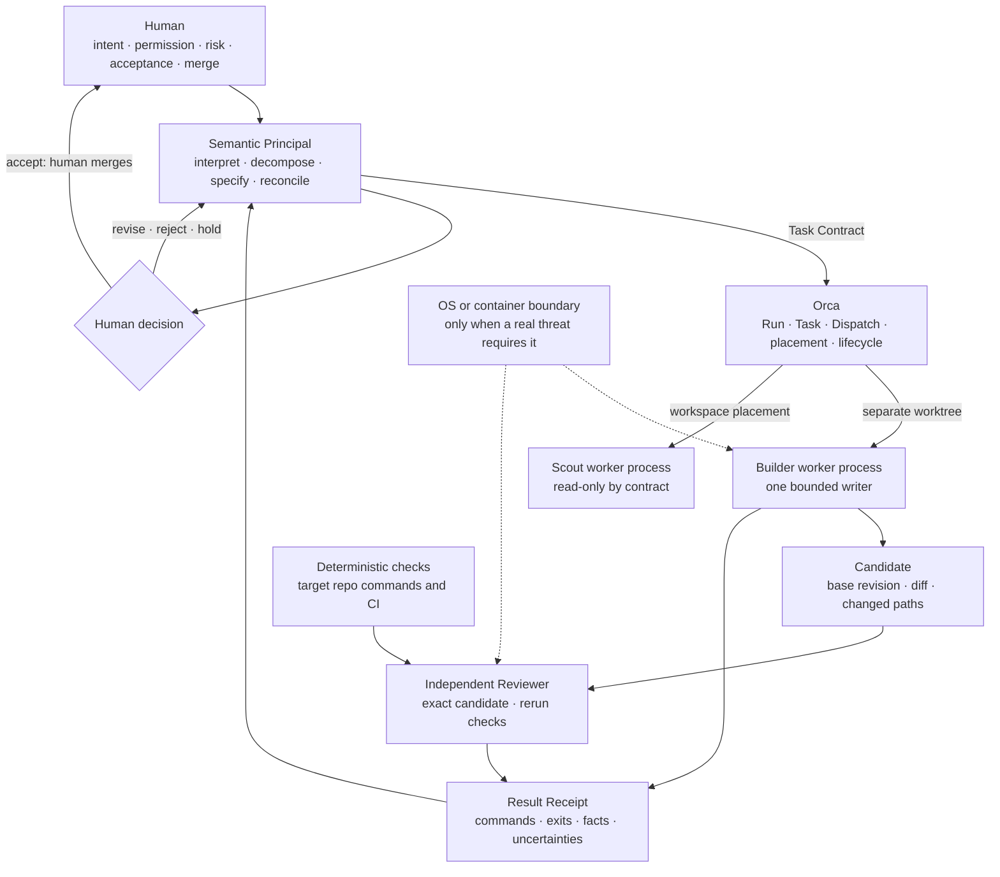

# Omega Zero architecture

## Decision

Omega Zero is a small workflow profile for real Orca-native daily work. It is not a runtime,
scheduler, product platform, or scaling claim. Orca supplies coordination and workspace mechanics;
the profile supplies human-approved operating rules, task/result language, and one
evidence-before-completion practice.

The profile is valuable only where a real target repository consumes it.

## Runtime sequence

Reading the diagram: the human is the only source of intent and the only merge authority. The
Principal converts intent into a contract and later reconciles receipts, but has no approval edge.
Orca places processes and records lifecycle; it has no semantic edge. The Builder is the only writer.
Git holds the exact candidate. The Reviewer works on that exact candidate, not on a summary. Checks
produce evidence, not permission. The decision node is human. The dashed OS/container boundary is
optional, conditional, and drawn outside the normal path.

## Authority matrix

| Concern | Authority | Explicit non-authority |
|---|---|---|
| Goal, permission, risk acceptance, candidate acceptance, merge | Human | Principal, Orca, worker, Reviewer, checks |
| Semantic decomposition and synthesis | Principal | Worker majority, Orca lifecycle |
| Run/Task/Dispatch identity, delivery, placement, settlement | Orca | Markdown ledger, terminal title |
| One bounded attempt | Worker CLI process | This profile repository |
| Base, branch, commit, diff, ancestry | Git | Agent prose, copied identifiers |
| Check result | Exact target-repository command; CI where it exists | A `passed` field written by an author |
| Challenge to a candidate | Independent Reviewer | The candidate's author alone |
| Containment of untrusted execution | OS or container | Git worktree, prompt text, regex gate |
| Profile rules | Root `AGENTS.md` | A generated hierarchy or registry |

## Monitoring

- **Orca** monitors lifecycle and workspace facts: placement, process state, delivery, settlement.
- **The Principal** monitors meaning: whether tasks express the intent, whether evidence supports
  claims, whether workers contradict each other, and whether rework is warranted.
- **The target repository's tools** monitor check behavior.
- **The human** monitors authority boundaries and makes every acceptance decision.

No second orchestrator, watchdog, message bus, or home-grown task store is added.

## Fleet, agents, skills, workspaces

- **Fleet** — the temporary set of tasks and dispatches for one goal, not a permanent catalog.
- **Agent** — one separately launched CLI/model process attempting one bounded dispatch.
- **Role** — a task shape such as Builder or Reviewer, not a permanent persona.
- **Skill** — an optional procedure available to a worker CLI. Skills are not agents and carry no
  authority; a skill cannot grant permission.
- **Workspace** — an exact read workspace or Git worktree. One writer per worktree.

Default topology: Principal, one Builder, one independent Reviewer.

## Security boundary

A worktree separates source state for cooperative writers; it does not contain malicious or
untrusted execution. OS or container containment is optional and is added only when a real threat
requires enforcement. A regex gate may add friction; it is not containment. Claims about isolation
must match the mechanism actually present.

## Reference validation tool

`tools/validate_evidence.py` is an optional reference validator for contract and receipt JSON.
It validates schema shape, declared path sets, and declared evidence collection counts only.
It does not execute commands, run through an agent CLI, inspect Git or Orca state, run tests, read any
path declared inside inputs, access the network, install dependencies, judge truth, ask for approvals,
or merge commits.

## Evidence boundary

What the rehearsal exercised and observed, with limitations: the loop runs — contract, dispatch,
separate-worktree candidate, independent review of the exact revision, check rerun, reconciliation,
worker release, and a stop before merge. That was a single run on a disposable fixture.

What remains open: a real public-safe run; any merge automation
(there is none); semantic correctness of a reviewed change (checks bound behavior, not meaning);
containment of hostile code (no isolation is implemented here); and scaling beyond one Builder and
one Reviewer (untested).
